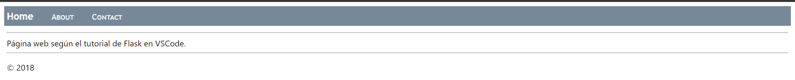

# Flask Tutorial in Visual Studio Code
## Crear y ejecutar una app de Flask
En la carpeta del entorno de flask, creamos un archivo llamado app.py donde tendremos el siguiente código:

~~~
from flask import Flask
app = Flask(__name__)
@app.route("/")
def home():
    return "Hello, FLask!"
~~~

Este programa importa la libreria Flask, crea la app y le proporciona una ruta de ejecución (la actual) y crear una función que muestra el string "Hello, Flask!".

## Usar una plantilla para renderizar la página
Si importamos render_template de flask y creamos una carpeta llamada "templates", podemos guardar ahí archivos html con el archivo html que queremos visualizar para que cuando ejecutemos la app, vaya a nuestro archivo en la carpeta templates para mostrar eso en el navegador.

~~~
@app.route("/hola")
def hello_there(name = "Hola"):
    return render_template(
        "hello_there.html", 
        name=name,
        date = datetime.now()
    )
~~~

Y nuestro archivo hello_there.html contiene: 
~~~
<!DOCTYPE html>
<html>
    <head>
        <meta charset="utf-8" />
        <title>Hello, Flask</title>
    </head>
    <body>
        
            <strong>Hello there, {{ name }}!</strong> It's {{ date.strftime("%A, %d %B, %Y at %X") }}.
        
            What's your name? Provide it after /hello/ in the URL.
        
    </body>
</html>
~~~

## Ficheros static
Podemos declarar un fichero staic, donde guardaremos un archivo tipo css y desde nuestro html enlazamos el css de la carpeta static y nuestro html.

El html:
~~~
<!DOCTYPE html>
<html>
    <head>
        <meta charset="utf-8" />
        <title>Hello, Flask</title>
        <link rel="stylesheet" href="{{url_for('static', filename='site.css')}}"/>
    </head>
    <body>
        
            Hello there, {{ name }}! It's {{ date.strftime("%A, %d %B, %Y at %X") }}.
        
            What's your name? Provide it after /hello/ in the URL.
        
    </body>
</html>
~~~

El css:
~~~
.message {
    font-weight: 600;
    color: blue;
}
~~~

## Fichero statico desde el codigo
En el fichero static creamos un json con el siguiente código:
~~~
{
    "01": {
        "note": "This data is very simple because we're demostrating only the mechanism."
    }
}
~~~

Y en app.py escribimos:
~~~
@app.route("/api/data")
def get_data():
    return app.send_static_file("data.json")
~~~ 

## Crear una pagina base con templates y estilos
Aquí crearemos un html llamado layout.html y modificaremos nuestro css para que quede de la siguiente forma:
~~~
<!DOCTYPE html>
<html>
    <head>
        <meta charset="utf-8" />
        <title></title>
        <link rel="stylesheet" type="text/css" href="{{ url_for('static', filename='site.css')}}" />
    </head>

    <body>
        

            <a href="{{ url_for('home') }}" class="navbar-brand">Home</a>
            <a href="{{ url_for('about') }}" class="navbar-item">About</a>
            <a href="{{ url_for('contact') }}" class="navbar-item">Contact</a>
        

        

            

            
            
            

            <footer>
                
&copy; 2018

            </footer>
        

    </body>
</html>
~~~

~~~
.navbar {
    background-color: lightslategray;
    font-size: 1em;
    font-family: 'Trebuchet MS', 'Lucida Sans Unicode', 'Lucida Grande', 'Lucida Sans', Arial, sans-serif;
    color: white;
    padding: 8px 5px 8px 5px;
}

.navbar a {
    text-decoration: none;
    color: inherit;
}

.navbar-brand {
    font-size: 1.2em;
    font-weight: 600;
}

.navbar-item {
    font-variant: small-caps;
    margin-left: 30px;
}

.body-content {
    padding: 5px;
    font-family:'Segoe UI', Tahoma, Geneva, Verdana, sans-serif;
}
~~~

## Crear un snippet
Por las páginas creadas en layout.html, es mejor crear un snippet para inicializar un nuevo template con la referencia apropiada al template base.
Para ello, vamos a File > Preferneces > Configure User Snippets e introducimos el siguiente código:
~~~
"Flask Tutorial: template extending layout.html": {
    "prefix": "flextlayout",
    "body": [
        "",
        "",
        "$0",
        "",
        "",
        ""
    ],

    "description": "Boilerplate template that extends layout.html"
},
~~~
Ahora creamos 3 archivos html: hola.html, about.html y contact.html y los rellenamos con el snippet poniendo en el block title el titulo de la página y en el block content una linea con una pequeña descripción.
Finalmente el fichero app.py queda de la siguiente forma: 

~~~
from datetime import datetime
from flask import Flask, render_template

app = Flask(__name__)
@app.route('/')

@app.route("/hola")
def hello_there():
    return render_template("layout.html")

# Replace the existing home function with the one below
@app.route("/")
def home():
    return render_template("home.html")

# New functions
@app.route("/about/")
def about():
    return render_template("about.html")

@app.route("/contact/")
def contact():
    return render_template("contact.html")

@app.route("/api/data")
def get_data():
    return app.send_static_file("data.json")

if __name__ == "__main__":
    app.run(debug=False)
~~~
Una vez ejecutamos el código, se abre el navegador y muestra la página web tal y como sale en el tutorial.
  